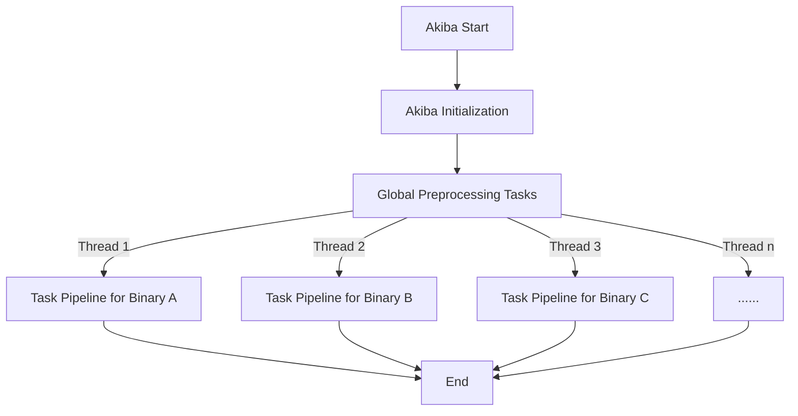
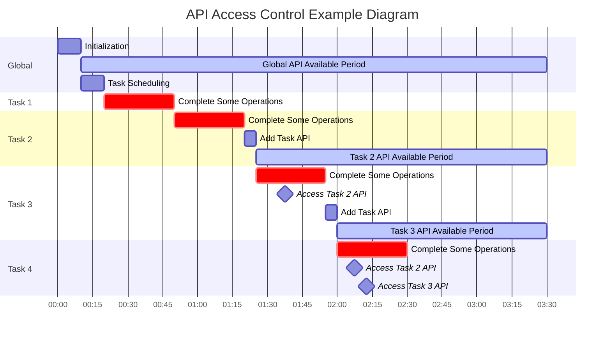

# Akiba Framework

## 1. Configuration Files

### `config.json` Main Configuration File

**You need to fill in some required configurations in the main configuration file to make Akiba run properly.**

Example configuration file:

```text
{
  // metadata: Main information of this task, currently not required and has no practical significance
  "metadata": {   
    "description": "Akiba Test"
  },
  // main: Main configuration. Actually, this configuration path can be modified freely. 
  // Just specify the correct file and JSON path within the file using the -c parameter of the framework.
  // For example, if the file name is config.json, then -c should be config.json@main. The default configuration is configs/config.json@/main
  // Note: JSON path uses Jackson format, i.e., separated by "/", similar to file names.
  "main": {
    // username, not Linux user
    "username": "akiba",
    // password
    "password": "akiba",
    // usingInstance: Name of using database instance, Akiba supports multiple instances
    "usingInstance": "akiba",
    // globalConsoleLogLevel: Global console log level. Alternative: OFF, TRACE, DEBUG, INFO, WARN, ERROR
    "globalConsoleLogLevel": "INFO"
    // globalFileLogLevel: Global file log level. Alternative: OFF, TRACE, DEBUG, INFO, WARN, ERROR
    "globalFileLogLevel": "INFO"
    // general: General configuration
    "general": {
      // binariesRoot: Root directory for binary files. When importing files, Akiba will copy files to the specified directory 
      // and name them uniformly as <id>.bin. This specifies the target directory for copying.
      "binariesRoot": "/data/binaries",
      // processor: Default processor architecture. If analyzing files with unknown architecture in the database, 
      // this architecture will be used by default. When set to n/a, multiple common architectures will be tried.
      "processor": "n/a",
      // autoAnalysisTimeout: Maximum automatic analysis time for Ghidra (in seconds).
      "autoAnalysisTimeout": 600,
      // threads: Maximum number of concurrent threads, referring to the maximum number of binary files that can be processed concurrently.
      "threads": 1
    },
    // withGhidraProject: Ghidra project configuration
    "withGhidraProject": {
      // projectRoot: Ghidra project root directory. Ghidra project files are saved here.
      "projectRoot": "./ghidra_projects",
      // name: Ghidra project name.
      "name": "analyzed_base_2",
      // mode: Mode for creating Ghidra projects, optional values: new, fork, base.
      //       new: Create a new project.
      //       fork: Copy an existing project and continue based on it. When set to fork, name is the original project name, and forkTo must be specified.
      //       base: Continue directly based on an existing project. When set to base, name is the original project name, and continueLog must be specified for this task.
      "mode": "new",
      // forkTo: When creating a project and set to fork, name is the original project name, and forkTo (target project name) must be specified.
      "forkTo": null,
      // continueLog: When creating a project and set to base, name is the original project name, and continueLog (log name for this task) must be specified.
      "continueLog": null,
      // overwriteLog: Whether to overwrite existing log files. If a log file already exists and overwriteLog is set to false, Akiba will refuse to start the task.
      "overwriteLog": true,
      // saveProject: Whether to save the Ghidra project. If set to false, the Ghidra project will be deleted after all tasks are completed.
      "saveProject": true,
      // noCreateProgram: Whether to automatically create Ghidra Program for binary files to be analyzed. Ghidra Program is the basis for binary analysis.
      //                  When Ghidra Program analysis is not needed (such as simply calculating file entropy), it can be set to true to reduce unnecessary steps.
      "noCreateProgram": false
    },
    // sqlSource: Database configuration
    "sqlSource": {
      // serverIP: IP address of Akiba database daemon
      "serverIP": "127.0.0.1",
      // serverPort: Port of Akiba database daemon, default is 31777
      "serverPort": "31777",
      // useSnapshot: Specify the database snapshot to use. This feature is not yet supported, reserved.
      "useSnapshot": "current",
      // constraint: ID filtering constraint. Default is empty, meaning all files in the database will be analyzed. 
      //             SQL statement fragments can also be filled in, such as "WHERE u.ID < 100".
      //             This fragment is concatenated with "SELECT u.ID FROM using_binaries u".
      "constraint": "",
      // disableUpdate: Whether to disable database updates. If set to true, Akiba will not update the database during this task. (This feature has not been tested)
      "disableUpdate": false
    },
    // dbImports: Database import configuration
    //            Sometimes a module needs output results from other modules, you can specify imported data tables in the import configuration file.
    //            In single-file pipeline analysis, the key of this part of data will be saved in the form of "data_name.column_name". For example, "test_results.function_number"
    "dbImports": [
      "test_results"
    ],
    // tasks: Task configuration
    "tasks": [
      {
        // mainClassName: Full path of the module main class. The module main class must inherit from AkibaModule class. Module file names start with amod and must be saved in the modules directory.
        //                Akiba searches for modules by obtaining main class information and loads all required classes together before analysis begins.
        "mainClassName": "org.iotsplab.akiba.process.TestModule",
        // configKey: Module configuration file path. This file will be used as the module's parameters. The module main class will obtain this file and parse it as a JSON object.
        //            The main configuration file and module configuration file can be written in the same file, distinguished by different JSON paths.
        //            When written in the same file, it can be abbreviated as "@@<path>".
        "configKey": "@@/TestModule",
        // consoleLogLevel: Console log level. Optional values: off, trace, debug, info, warn, error.
        "consoleLogLevel": "debug",
        // fileLogLevel: File log level. Optional values: off, trace, debug, info, warn, error.
        "fileLogLevel": "debug",
        // timeout: Module execution timeout (in seconds). After timeout, Akiba will cancel the module's execution. There is an API within the module to decide whether to continue running subsequent modules after timeout.
        "timeout": 600
      }
    ]
  },
  // TestModule: TestModule module configuration. It can be written in any location except the /main path of this file, just specify the correct path.
  "TestModule": {
    "name": "ExampleUser",
    "age": 25,
    "department": "Engineering",
    "salary": 50000
  }
}
```

### `log4j2.xml` Log Configuration

The log configuration file is used to specify Akiba's main log output. In Akiba, each task can specify a file log output and a console log output. The log levels of these two log outputs can be specified in the main configuration file.

```xml
<?xml version="1.0" encoding="UTF-8"?>
<Configuration status="WARN">
    <Properties>
        <Property name="consolePattern">
             %msg%n
        </Property>
    </Properties>
    <Appenders>
        <Console name="Console" target="SYSTEM_OUT">
            <PatternLayout pattern="%d %highlight{%-5level}{ERROR=Bright RED, WARN=Bright Yellow, INFO=Bright Green, DEBUG=Bright Cyan, TRACE=Bright White} %style{[%t]}{bright,magenta} %style{%c{1.}.%M(%L)}{cyan}: %msg%n"/>
        </Console>
    </Appenders>
    <Loggers>
        <Root level="info">     <!-- change here for root logger -->
            <AppenderRef ref="Console"/>
        </Root>
    </Loggers>
</Configuration>
```

### `import-example.json` Import Configuration File

The import configuration file is used for Akiba's file import task and can be used to batch import binary files. Here is an example file.

```json
{
  "entries": [
    {
      "path": "imported/binaryfile.bin",
      "property_1": "aaa",
      "property_2": "bbb"
    }
  ]
}
```

If you want to add files or folders (if importing a folder, all files in the folder are considered binary files to be imported), you need to add an entry in the import configuration. `path` is used to specify the file path, required; `arch` is optional, used to specify the file architecture. When Ghidra cannot determine the architecture of the binary file, the `arch` in the import configuration file will be used for analysis. If `arch` is not specified, the architecture of the imported binary file will be automatically determined by Ghidra and Akiba. When Ghidra cannot determine it, Akiba will try to determine it. If both fail, the architecture of the binary file will be recorded as `n/a`. In addition to the above two fields, you can also add other fields at will. These fields will be saved in the `global_data` of the database and can be read and written by all tasks analyzing the binary file.

Note: **All added paths must be relative paths to the root directory set in the main configuration file (`general.binariesRoot` in `config.json`)**

## 2. Task Coroutines

Akiba mainly serves **large-scale binary file analysis tasks**, and each binary file will start a task pipeline. The overall process is as follows:



Binary file analysis tasks are controlled through coroutines, and their maximum parallelism is controlled by `general.threads` in the main configuration file. Each task pipeline consists of multiple tasks defined by `AutoProcess` subclasses and can be arranged in any order.

If you need to change the execution order of tasks or disable certain subprocesses, you can configure `procedures` in the main configuration file. See the annotation description in `config.json` for details.

To facilitate interaction between different tasks, Akiba creates 2 coroutine contexts for each task, one for global scope and another for pipeline scope. APIs under global scope can be accessed by all tasks, while APIs under pipeline scope of a binary file can only be accessed by tasks in the task pipeline analyzing that binary file.



As shown in the figure above, for subprocess 2, the pipeline scope API it generates can only be accessed by subprocess 2 and subsequent tasks.

### How to Add API

Use the annotation `GlobalLateinitInterface` to mark methods.

For global preprocessing tasks, these methods will be added to the global scope coroutine context, and you can call them using `coroutineContext[GlobalContextKey]!!.call(method, *args)`.

For pipeline tasks, these methods will be added to the pipeline scope coroutine context, and you can call them using `coroutineContext[TaskContextKey]!!.call(method, *args)`.

The `HTTPServer` class can register all methods with the `GlobalLateinitInterface` annotation, so web server methods can be accessed, so you can also use `GlobalLateinitInterface` in subclasses of `DynamicServer`.

**Note: All APIs must be accessed as singletons!**

## 3. Task Data Processing

Akiba allows tasks to process data in various ways, including multiple data sources.

### 3.1 Data to be Saved to Database

Each binary file has a unique ID in the database. In the `results` table, the column `global_data` is used to save data. Data can be written here by tasks or modified by users at will. It is a JSON string parsed through JSON path in tasks.

Note: A task cannot access the `global_data` of other binary files; it can only read the corresponding data of the binary file it analyzes.

### 3.2 Temporary Data

During pipeline analysis, some data may not need to be saved to the database. Akiba provides two APIs to allow tasks to read or write temporary data, saved in a `HashMap<String, Any?>` of the pipeline scope:

- `getTaskData(key: String?)`: Returns data for the given key. If key is empty, returns all data
- `setTaskData(key: String, value: Any?)`: Sets data for the given key.

If your task needs to access temporary data, it is recommended to use the annotation class `DataConsumer` to specify the required key and type. Conversely, if your task needs to provide data to other tasks, you can use the annotation class `DataProducer` to specify the key and type of data your task can provide.

### 3.3 Task-Specific Data

If you need to run many tasks and don't want to mix data together in `global_data`, you can define task-specific data by using the annotation class `DatabaseColumn` to specify the key and type of data your task needs to define. That is to say, each task can have its own dedicated data table, and the structure can be completely customized.

Currently, the database only supports several data types:
- `text`: Input data should be convertible to `String`
- `integer`: Input data should be convertible to `Long`
- `double precision`: Input data should be convertible to `Double`
- `bytea`: Input data should be convertible to `ByteArray`
- `timestamptz`: Input data should be convertible to `LocalDateTime`
- `jsonb`: Input data should be convertible to `JsonElement`
- `boolean`: Input data should be convertible to `Boolean`
- `uuid`: Input data should be convertible to `UUID`
- `interval`: Input data should be convertible to `Duration`

APIs:
- `createDatabase`: Creates a task-specific database. This method does not need to be called explicitly; it will be called when each task is instantiated, so no manual call is needed.
- `updateData`: Updates data to the task-specific database. For a binary file with a given ID, the task can only update the corresponding data of that binary file. If the ID does not exist in the database, a new entry will be created and updated; otherwise, old data will be replaced.
    - Note: `updateData` is implemented in a secure way and will not cause SQL injection.

### 3.4 Task Reserved Data

When creating a data table, in addition to user-required data columns, Akiba will also add some columns to save runtime information:

- `id`: ID of the binary file
- `start_timestamp`: Start time of this task for the binary file (type is `timestamptz`)
- `finish_timestamp`: End time of this task for the binary file (type is `timestamptz`)
- `execute_time`: Execution time of this task for the binary file (type is `interval`)
- `err_msg`: Error information of this task for the binary file (type is `text`)

Akiba provides an API to allow tasks to save error information. Tasks can update error information through `updateErr`. Error information is saved in the column `err_msg` of each module's data table.

### 3.5 Summary

In summary, Akiba currently supports multiple types of data updates, but always keep one key point in mind: **Pipeline Scope**. Because each binary file has a unique ID, for all tasks processing a certain binary file, the task can and can only control all data of that binary file. This ensures that tasks cannot affect the analysis data of other binary files.

## 4. Log Files

Akiba saves logs generated by different binary files and different modules separately for easy reference and debugging after task completion.

Log files are uniformly saved in the `log` directory of the Akiba root directory. At the beginning of a task, Akiba will create the log root directory for this task. The directory name is specified by the relevant configuration in `withGhidraProject` of the main configuration. Under normal circumstances, after a task run is completed, the file structure under this log directory should be roughly as follows:

```text
<log root>
    Root.log                // Root log file, saves root logs
    config.json             // Configuration file for this task. If the configuration specified at the start of the task is located in multiple configuration files, Akiba will merge these configuration files into one file and save it
    properties.json         // Related data of target binary files for this task
    <failed>                // Binary files that failed to run
        <1>                 // Log directory of binary file #1 analysis pipeline
            Module1.log     // Log generated by module Module1 when analyzing binary file #1
            Module2.log     // Log generated by module Module2 when analyzing binary file #1
        <2>
            Module1.log
            Module2.log
    <runtime_error>         // Binary files with runtime errors during analysis
        <3>
            ...
    <success>               // Binary files that completed analysis successfully
        <4>
            ...
        ...
```

## 5. Script Files

### starter.py

A script used to monitor the execution of the Kotlin process. When the log file has not been updated for more than 20 minutes (configurable), it will restart and resume the process (automatically perform breakpoint continuation).
All parameters needed by Akiba can be specified in the script.
Tip: In Linux, you can add a `&` to the command line to run the command in the background. For example: `python3 starter.py &`

